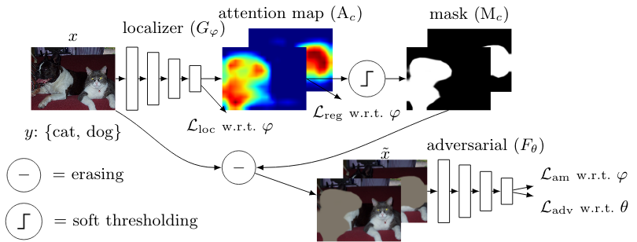
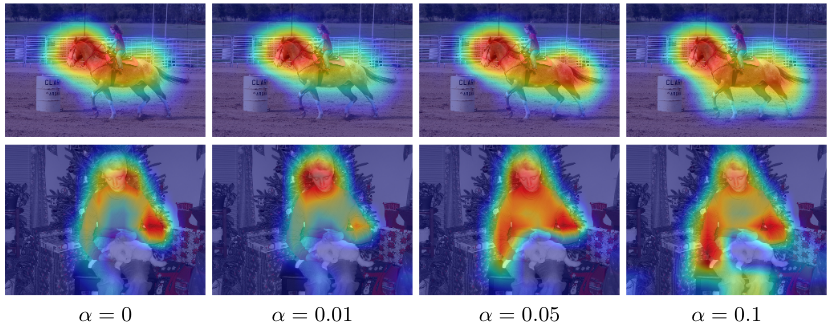

# EADER
[End-to-End Adversarial Erasing for Weakly Supervised Semantic Segmentation](https://arxiv.org/abs/2011.04626)



#### Abstract
Semantic segmentation is a task that traditionally requires a large dataset of pixel-level ground truth labels, which is time-consuming and expensive to obtain.
Recent advancements in the weakly-supervised setting show that reasonable performance can be obtained by using only image-level labels. 
Classification is often used as a proxy task to train a deep neural network from which attention maps are extracted.
However, classification needs only the minimum evidence to make predictions, hence it focuses on the most discriminative object regions. 
To overcome this problem, we propose a novel formulation of adversarial erasing of the attention maps.
In contrast to previous methods, we optimize two networks with opposing loss functions.
The proposed solution is simple, requires less supervision than previous methods and is easy to integrate into existing weakly-supervised segmentation approaches. 


Alpha is the parameter that controls the strength of the adversarial loss term. By increasing it, the region covered by the attention map increases to less discriminative object regions.


## Requirements
```
python >= 3.6
NVIDIA GPU w/ cuDNN
```
This was developed and tested on Ubuntu 18.04 using a single Tesla V100 GPU.

## Installation
- Create a new virtual environment
- `pip install -r requirements.txt`
- We recommend to download a fresh copy of the Pascal VOC 2012 dataset because we will patch it to use torchvision's built-in VOC dataset definition with the augmented dataset. Use `--download_dataset` on your first run, it will be downloaded to the location specified with `--dataset_root`. 
- To use the augmented trainingset download it from [here](https://github.com/DrSleep/tensorflow-deeplab-resnet) and extract it. Copy the files to the downloaded dataset location, e.g. `cp SegmentationClassAug/* $dataset_root/VOCdevkit/VOC2012/SegmentationClass/`. Next, you need to update the `ImageSets/Segmentation/train.txt` file to use all 10582 training images, e.g.:  `cp data/train.txt $dataset_root/VOCdevkit/VOC2012/ImageSets/Segmentation/train.txt`
- Before training starts you should get the following numbers: `Training set size: 10582, validation set size: 1449`

## Training
#### Example training configurations
Localizer only (no adversarial erasing):
```sh
python train.py --dataset_root $dataset_root --experiment_name localizer_only 
```
Localizer + adversarial:
```sh
python train.py --dataset_root $dataset_root --experiment_name localizer_adversarial --adversarial_model resnet18
```
See `train.py` for all the available command line arguments.

## Evaluation
After (or during) training you can use a checkpoint file using the `resume` parameter to evaluate the performance (mIoU, precision and recall):
```sh
python train.py --dataset_root $dataset_root --experiment_name evaluation --resume $experiment_name/checkpoint.pth.tar --evaluate
```

## Citation
If you code from this repository, please cite the following paper
```
@article{stammes2020find,
  title={Find it if You Can: End-to-End Adversarial Erasing for Weakly-Supervised Semantic Segmentation},
  author={Stammes, Erik and Runia, Tom FH and Hofmann, Michael and Ghafoorian, Mohsen},
  journal={arXiv preprint arXiv:2011.04626},
  year={2020}
}
```